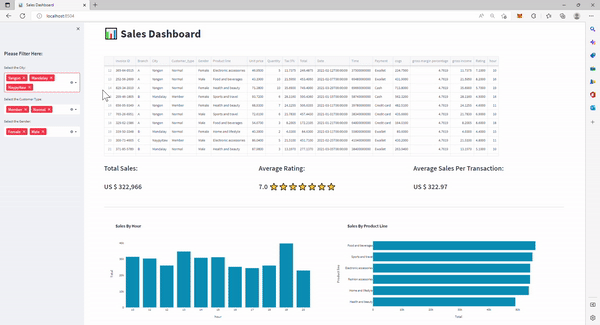

# Streamlit app using Interactive Excel Aggregation.

https://richiegarafola-kpi-sales.streamlitapp.com/

Aggregate your Excel spreadsheets interactively!

In this platform I will display the power of Python using the streamlit library to build an interactive web application.
I will build a KPI that aggregates data tailored to the users interest and visually display the output
 
---

**Libraries Used:** Streamlit for the open-source app framework, Plotly Express for interactive data visualization, Pandas for datastructuring and analysis. 

The excel file that was used in this project can be found here:
**Excel File:** [Excel File](supermarkt_sales.xlsx)

---

**For this assignment, there are three main tasks:**

For this assignment, there are three main tasks:

1. [Read in and Wrangle Data](#Prepare-the-Data)

2. [Explore the data](#Data-Exploration-And-Visualization)

3. [Build a Custom Web App](#Build-a-Custom-Web-App)

---

## Instructions

**File:** [App](app.py)

### Prepare the Data

First, read and clean our excel file for analysis. The excel file includes one thousands invoice IDs, broken down by:
'Invoice ID', 'Branch', 'City', 'Customer_type', 'Gender', 'Product line', 'Unit price', 'Quantity', 'Tax 5%', 'Total', 'Date',
'Time', 'Payment', 'cogs', 'gross margin percentage', 'gross income', 'Rating', 'hour'

1. Use Pandas to read the excel file as a DataFrame using the read_excel() method
2. Add an 'hour' column to the dataframe
    - convert the column to a datetime object using pandas 'to_datetime()' method
    - format the time into hours minutes seconds and then extract the hour using the dt.hour 

    * `supermarkt_sales.xlsx`: Contains the dataset we will be working with.

### Data-Exploration-And-Visualization
1. Create filters based on city, customer type and gender
2. Create a query based on filters 'city', 'customer_type', and 'gender' 
    *use @ to refer to the variable
3. Develop KPIs that will display the 'total_sales', 'average_rating', 'star_rating', and 'average_sale_by_transaction'
    - total_sales is the sum of the 'total' column, returning an int number without decimal values.
    - 'average_rating'- round the mean of the 'rating' column by 1 decimal, 
    - illustrate the rating score by using the star emoji, average the rating to the nearest round number by using int
    - calculate the 'average_sale_by_transaction' by applying the .mean() method to the 'Total' column
4. Use the plotly express library to plot the data into barcharts.

### Build a Custom Web App

**View the Streamlit application**
Run the Streamlit application to view a completed web app. To do so, complete the following steps:

1. In the terminal, navigate to the projects folder.
2. In the terminal, run the Streamlit application by using streamlit run "app.py"

---

## Resources

* [Plotly - Express](https://plotly.com/python-api-reference/plotly.express.html)

